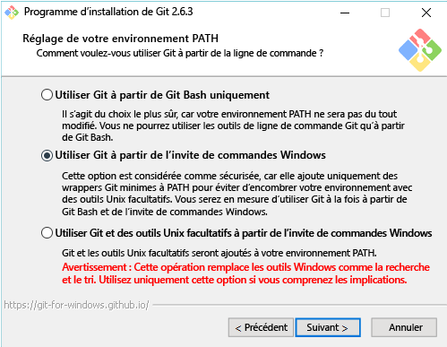

# <a name="contribute-to-the-docs"></a>Contribution à la documentation

> **Remarque:** Pour pouvoir contribuer, vous devez avoir un compte [GitHub](https://www.github.com).

## <a name="edit-an-existing-doc"></a>Modification d’un document existant

1. Recherchez le document à modifier.  

2. Sélectionnez **Contribute to this topic**  
  
  
  Cela vous redirige automatiquement vers le fichier markdown associé à ce fichier dans GitHub.
  
  Assurez-vous que vous êtes connecté à GitHub.  Si ce n’est pas le cas, connectez-vous ou créez un compte GitHub.
  
  
  
3. Sélectionnez l’icône d’édition pour modifier dans l’éditeur du navigateur.
  
  

4. Apportez les modifications en ligne.
  
  Actions possibles:
  1. Modifier le fichier
  2. Prévisualiser les modifications
  3. Renommer le fichier (il est peu probable que vous souhaitiez le faire)
  
  
  
5. Proposer vos modifications en tant que requête de tirage
  
  

6. Réviser vos modifications
  
  **Ce que nous recherchons dans une requête de tirage**  
  * La modification est correcte: elle représente réellement la technologie
  * L’orthographe et la grammaire sont correctes
  * Emplacement logique dans la documentation
    
  

7. Créer une [requête de tirage](contribute-to-docs.md#pull-requests)  

## <a name="pull-requests"></a>Requêtes de tirage

La plupart des modifications sont validées par une requête de tirage.  Une requête de tirage permet de réviser un ensemble de modifications avec plusieurs réviseurs, ainsi que de modifier et commenter le contenu actuel.


## <a name="fork-the-repo-and-edit-locally"></a>Répliquer le dépôt et modifier localement

Pour le travail sur la documentation à long terme, clonez le dépôt localement et travaillez sur votre ordinateur.

Le guide suivant vous montre comment émuler ma configuration (celle de Sarah Cooley).  Il existe de nombreuses autres configurations qui fonctionnent tout aussi bien.

> **Remarque:** Tous ces outils de documentation fonctionnent aussi bien sur Linux/OSX.  Si vous souhaitez d’autres guides, demandez.

Ce guide est constitué de trois sections:
* [Configurer Git](contribute-to-docs.md#set-up-git)
  * installation de Git
  * configuration initiale
  * réplication du dépôt de documentation
  * clonage de votre copie sur l’ordinateur local
* [Gestion des informations d’identification de départ](contribute-to-docs.md#validate-and-stash-credentials)
  * informations sur la dissimulation des informations d’identification et l’assistant d’identification.
* [Configurer l’environnement de documentation](contribute-to-docs.md#set-up-markdown-editing-environment)
  * installer VSCode
  * description de quelques fonctionnalités pratiques avec VSCode pour Git
  * effectuer une première validation.

### <a name="set-up-git"></a>Configurer Git

1. Installer Git (sur Windows) à partir d’[ici](https://git-for-windows.github.io/)

  Vous ne devez modifier qu’une seule valeur dans l’installation:

  **Ajustement de votre environnement PATH** Utiliser Git à partir de l’invite de commandes Windows

  

  Vous pouvez ainsi utiliser des commandes Git dans la console PowerShell/n’importe quelle console Windows.

2. Configurer votre identité Git

  Ouvrez une fenêtre PowerShell et exécutez:

  ``` PowerShell
  git config --global user.name "User Name"
  git config --global user.email username@microsoft.com
  ```

  Git utilise ces valeurs pour étiqueter vos validations.

  > Si l’erreur suivante s’affiche, Git n’est probablement pas installé correctement ou vous devez relancer PowerShell.
    ``` PowerShell
    git : The term 'git' is not recognized as the name of a cmdlet, function, script file, or operable program. Check the spelling of the name, or if a path was included, verify that the path is correct and try again.
    ```

3. Configurer votre environnement Git

   Installez un assistant d’identification pour n’avoir à entrer le nom d’utilisateur et le mot de passe qu’une seule fois (au moins sur cet ordinateur).
   J’utilise cet [assistant d’identification Windows](https://github.com/Microsoft/Git-Credential-Manager-for-Windows#download-and-install) de base

   Une fois l’installation terminée, exécutez les commandes suivantes pour activer l’assistant d’identification et définir votre comportement de type Push:
   ```
   git config --global credential.helper manager
   git config --global push.default simple
   ```

   La première fois que vous devez vous authentifier auprès de GitHub, le système vous demande votre nom d’utilisateur et le code d’authentification à deux facteurs si vous l’avez activé.
   Exemple:
   ```
   C:\Users\plang\Source\Repos\Virtualization-Documentation [master]> git pull
   Please enter your GitHub credentials for https://github.com/
   username: plang@microsoft.com
   password:
   authcode (app): 562689
   ```
   Vous recevez automatiquement un [jeton d’accès personnel](https://github.com/settings/tokens) avec les autorisations appropriées sur GitHub, que vous stockez en lieu sûr sur l’ordinateur local. Aucune demande ne devrait vous être faite par la suite.

4. Répliquer le dépôt

5. Cloner le dépôt

  Git Clone effectue une copie locale du dépôt Git avec les raccordements appropriés pour la synchronisation avec d’autres clones du même dépôt.

  Par défaut, Git Clone crée un dossier avec le même nom que le dépôt dans le répertoire actif.  Je conserve tous mes dépôts Git dans mon répertoire utilisateur.  En savoir plus sur Git Clone [ici](http://git-scm.com/docs/git-clone).

  ``` PowerShell
  cd ~
  git clone https://github.com/Microsoft/Virtualization-Documentation.git
  ```

  Si l’opération a réussi, vous avez maintenant un dossier `Virtualization-Documentation`.

  ``` PowerShell
  cd Virtualization-Documentation
  ```

5. [Facultatif] Configurer Posh-Git

  Posh-Git est un module PowerShell créé par la communauté qui facilite l’utilisation de Git dans PowerShell.  Il ajoute la saisie semi-automatique via la touche Tab pour Git dans PowerShell et peut également faire en sorte que l’invite affiche des informations utiles sur la création de branches et l’état des fichiers.  En savoir plus [ici](https://github.com/dahlbyk/posh-git).  Vous pouvez installer Posh-Git en exécutant la commande suivante dans une console Administrateur PowerShell.

  ``` PowerShell
  Install-Module -Name posh-git
  ```

  Pour que Posh-Git fonctionne automatiquement chaque fois que vous démarrez PowerShell, ajoutez le code suivant à votre profil PowerShell (par exemple, `%UserProfile%\My Documents\WindowsPowerShell\profile.ps1 `)

  ``` PowerShell
  Import-Module posh-git

  function global:prompt {
    $realLASTEXITCODE = $LASTEXITCODE

    Write-Host($pwd.ProviderPath) -nonewline

    Write-VcsStatus

    $global:LASTEXITCODE = $realLASTEXITCODE
    return "> "
  }
  ```

### <a name="validate-and-stash-credentials"></a>Valider et dissimuler les informations d’identification

  Pour valider que le dépôt est correctement configuré, essayez d’extraire un nouveau contenu.

  ``` PowerShell
  git pull
  ```


### <a name="set-up-markdown-editing-environment"></a>Configurer l’environnement d’édition Markdown

1. Téléchargez VSCode

6. Effectuez un test de validation.  Si vos informations d’identification sont correctement dissimulées, tout devrait parfaitement fonctionner.


