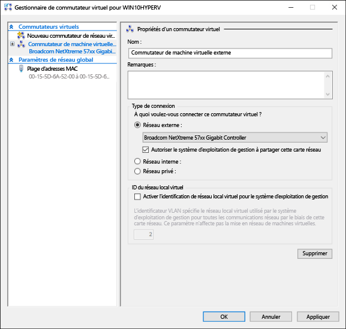

# <a name="create-a-virtual-network"></a>Créer un réseau virtuel

Vos machines virtuelles auront besoin d’un réseau virtuel pour le partage d’un réseau avec votre ordinateur.  La création d’un réseau virtuel est facultative; si votre machine virtuelle ne doit pas nécessairement être connectée à Internet ou à un réseau, passez directement à l’étape de [création d’une machine virtuelle Windows](create-virtual-machine.md).


## <a name="connect-virtual-machines-to-the-internet"></a>Connecter des machines virtuelles à Internet

Hyper-V dispose de trois types de commutateurs virtuels: externes, internes et privés. Créez un commutateur externe pour partager le réseau de votre ordinateur avec les machines virtuelles en cours d’exécution sur ce dernier.

Cet exercice montre comment créer un commutateur virtuel externe. Lorsque vous l’aurez terminé, votre hôte Hyper-V disposera d’un commutateur virtuel capable de connecter des machines virtuelles à Internet via une connexion réseau de votre ordinateur. 

### <a name="create-a-virtual-switch-with-hyper-v-manager"></a>Créer un commutateur virtuel avec le Gestionnaire Hyper-V

1. Ouvrez le Gestionnaire Hyper-V.  Une méthode rapide consiste à appuyer sur la touche ou le bouton Windows, puis à taper «Gestionnaire Hyper-V».  
Si la recherche ne trouve pas le Gestionnaire Hyper-V, cela signifie qu’Hyper-V ou les outils de gestion Hyper-V ne sont pas activés.  Consultez les instructions d’activation d’Hyper-V [ici](enable-hyper-v.md).

2. Sélectionnez le serveur dans le volet gauche ou cliquez sur «Se connecter au serveur...» dans le volet droit.

3. Dans le Gestionnaire Hyper-V, sélectionnez **Gestionnaire de commutateur virtuel...** dans le menu «Actions» situé sur la droite. 

4. Dans la section «Commutateurs virtuels», sélectionnez **Nouveau commutateur réseau virtuel**.

5. Sous «Quel type de commutateur virtuel voulez-vous créer?», sélectionnez **Externe**.

6. Sélectionnez le bouton **Créer un commutateur virtuel**.

7. Sous «Propriétés du commutateur virtuel», attribuez un nom au nouveau commutateur, par exemple **Commutateur de machine virtuelle externe**.

8. Sous «Type de connexion», vérifiez que l’option **Réseau externe** est sélectionnée.

9. Sélectionnez la carte réseau physique à associer au nouveau commutateur virtuel. Il s’agit de la carte réseau qui est physiquement connectée au réseau.  

    

10. Sélectionnez **Appliquer** pour créer le commutateur virtuel. À ce stade, il est probable que le message ci-dessous s’affiche. Cliquez sur **Oui** pour continuer.

      

11. Sélectionnez **OK** pour fermer la fenêtre Gestionnaire de commutateur virtuel.


### <a name="create-a-virtual-switch-with-powershell"></a>Créer un commutateur virtuel avec PowerShell

Pour créer un commutateur virtuel avec une connexion externe à l’aide de PowerShell, effectuez les étapes suivantes. 

1. Pour obtenir la liste des cartes réseau connectées au système Windows10, utilisez la commande **Get-NetAdapter**.

    ```powershell
    PS C:\> Get-NetAdapter

    Name                      InterfaceDescription                    ifIndex Status       MacAddress             LinkSpeed
    ----                      --------------------                    ------- ------       ----------             ---------
    Ethernet 2                Broadcom NetXtreme 57xx Gigabit Cont...       5 Up           BC-30-5B-A8-C1-7F         1 Gbps
    Ethernet                  Intel(R) PRO/100 M Desktop Adapter            3 Up           00-0E-0C-A8-DC-31        10 Mbps  
    ```

2. Sélectionnez la carte réseau à utiliser avec le commutateur Hyper-V, puis placez une instance dans une variable nommée **$net**.

    ```
    $net = Get-NetAdapter -Name 'Ethernet'
    ```

3. Exécutez la commande suivante pour créer le commutateur virtuel Hyper-V.

    ```
    New-VMSwitch -Name "External VM Switch" -AllowManagementOS $True -NetAdapterName $net.Name
    ```

## <a name="virtual-networking-on-a-laptop"></a>Configuration d’un réseau virtuel sur un ordinateur portable

### <a name="nat-networking"></a>Mise en réseau NAT
La traduction d’adresses réseau (NAT, Network Address Translation) permet à une machine virtuelle d’accéder au réseau de votre ordinateur en combinant l’adresseIP de l’ordinateur hôte avec un port par le biais d’un commutateur virtuel Hyper-V interne.

Ce mécanisme est utile à divers égards:
1. NAT préserve les adressesIP en mappant une combinaison d’adresseIP externe et de numéro de port avec un jeu beaucoup plus large d’adressesIP internes. 
2. De plus, NAT permet à plusieurs machines virtuelles d’héberger des applications nécessitant des ports de communication (internes) identiques en les mappant à des ports externes uniques.
3. NAT utilise un commutateur interne; la création d’un commutateur interne ne vous oblige pas à utiliser la connexion réseau et tend à interférer dans une moindre mesure avec les fonctions réseau de l’ordinateur.

Pour configurer un réseau NAT et le connecter à une machine virtuelle, reportez-vous au [guide de l’utilisateur consacré à la configuration d’un réseau NAT](../user-guide/setup-nat-network.md).

### <a name="the-two-switch-approach"></a>L’approche à deux commutateurs

Si vous exécutez Windows 10 Hyper-V sur un ordinateur portable et que vous basculez fréquemment entre un réseau sans fil et un réseau câblé, vous voudrez peut-être créer un commutateur virtuel pour les cartes réseau sans fil et ethernet.  En fonction de la façon dont l’ordinateur portable se connecte au réseau, vous pouvez modifier vos machines virtuelles entre ces commutateurs. Machines virtuelles ne pas basculer entre câblées et sans fil automatiquement. 

>[!IMPORTANT]
>L’approche à deux commutateurs ne gère pas le commutateur virtuel externe sur la carte sans fil et doit être utilisé uniquement à des fins de test.

## <a name="next-step---create-a-virtual-machine"></a>Étape suivante: créer une machine virtuelle
[Créer une machine virtuelle Windows](create-virtual-machine.md)
