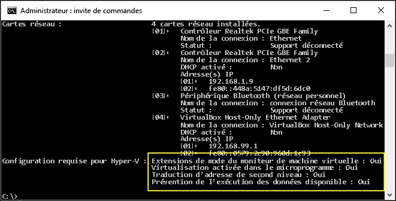

# Configuration requise pour Hyper-V sur Windows 10

Pour faire fonctionner Hyper-V sur Windows 10, votre matériel et votre système d’exploitation doivent répondre à un ensemble spécifique de configurations. Ce document présente la configuration requise pour Hyper-V, et indique comment vous pouvez vérifier la compatibilité de votre système.

## Systèmes d'exploitation requis

Le rôle Hyper-V peut être activé sur ces versions de Windows 10 :

- Windows 10 Entreprise
- Windows 10 Professionnel
- Windows 10 Éducation

Le rôle Hyper-V **ne peut pas** être installé sur :

- Windows 10 Famille
- Windows 10 Mobile
- Windows 10 Mobile Entreprise

>Windows 10 Famille peut être mis à niveau vers Windows 10 Professionnel. Pour cela, ouvrez **Paramètres** > **Mise à jour et sécurité** > **Activation**. Vous pouvez alors visiter le magasin et acheter la mise à niveau.

## Configuration matérielle requise

Bien que ce document ne fournisse pas la liste complète du matériel compatible avec Hyper-V, vous devez disposer des éléments suivants :
    
- Processeur 64 bits avec traduction d’adresse de second niveau (SLAT).
- Processeur prenant en charge les extensions de mode du moniteur de machine virtuelle (VT-c sur les processeurs Intel).
- Au minimum 4 Go de mémoire. Étant donné que les machines virtuelles partagent la mémoire avec l’hôte Hyper-V, vous devez fournir suffisamment de mémoire pour gérer la charge de travail virtuelle attendue.

Les éléments suivants doivent être activés dans le BIOS du système :
- Technologie de virtualisation (cette appellation peut varier selon le fabricant de la carte mère).
- Prévention de l’exécution des données appliquée par le matériel.

## Vérifier la compatibilité matérielle

Pour vérifier la compatibilité, ouvrez PowerShell ou une invite de commandes (cmd.exe), puis tapez **systeminfo**. Si tous les éléments de la configuration requise pour Hyper-V ont la valeur **Oui**, votre système peut exécuter le rôle Hyper-V. Si l’un des éléments a la valeur **Non**, passez en revue la configuration requise figurant dans ce document et apportez des ajustements dans la mesure du possible.



Si vous exécutez **systeminfo** sur un hôte Hyper-V existant, la section Configuration requise pour Hyper-V indique ce qui suit :

```
Hyper-V Requirements: A hypervisor has been detected. Features required for Hyper-V are not be displayed.
```


<!--HONumber=Jan17_HO2-->


