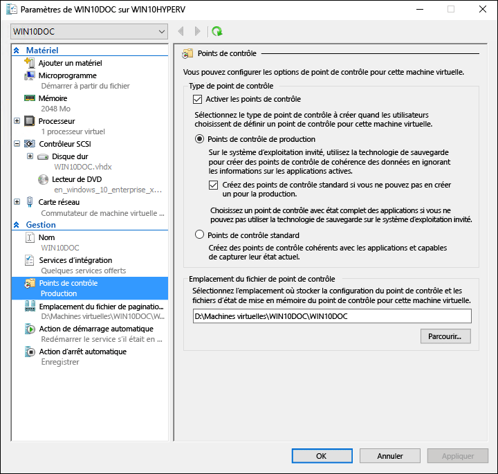
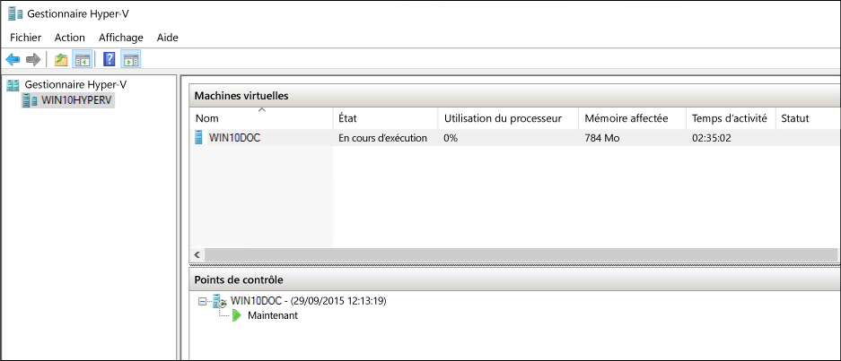
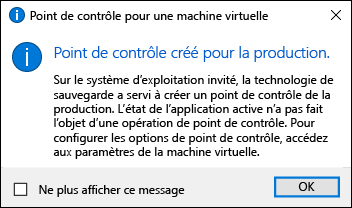

# Utilisation de points de contrôle pour restaurer des machines virtuelles à un état antérieur

L’un des principaux avantages de la virtualisation est la possibilité d’enregistrer facilement l’état d’une machine virtuelle. Dans Hyper-V, cette opération se fait par le biais de points de contrôle de machine virtuelle. La création d’un point de contrôle de machine virtuelle peut s’avérer utile avant la modification de la configuration des logiciels, avant l’application d’une mise à jour logicielle ou encore avant l’installation de nouveaux logiciels. En cas de problème engendré par une modification du système, vous pouvez restaurer la machine virtuelle à l’état dans lequel elle se trouvait au moment de la prise du point de contrôle.

Dans Windows10, Hyper-V comprend deux types de points de contrôle:

* **Points de contrôle standard**: une capture instantanée de la machine virtuelle et de l’état de sa mémoire est prise lors de l’initiation du point de contrôle. Une capture instantanée n’étant pas une sauvegarde complète, il peut entraîner des problèmes de cohérence des données avec les systèmes qui répliquent les données entre différents nœuds (comme Active Directory).  Avant Windows10, Hyper-V offrait uniquement des points de contrôle standard (anciennement nommés captures instantanées).

* **Points de contrôle de production**: ils utilisent le service VSS (Volume Shadow Copy Service) ou File System Freeze sur une machine virtuelle Linux pour créer une sauvegarde cohérente des données de la machine virtuelle. Aucune capture instantanée de l’état de la mémoire de la machine virtuelle n’est prise.

Les points de contrôle de production sont sélectionnés par défaut, mais vous pouvez les modifier à l’aide du Gestionnaire Hyper-V ou de PowerShell.

> **Remarque:** Le module PowerShell Hyper-V ayant plusieurs alias, vous pouvez utiliser indifféremment un point de contrôle et une capture instantanée.  
  Bien que ce document utilise le point de contrôle, sachez que des commandes similaires peuvent utiliser le terme «capture instantanée».

## Modification du type de point de contrôle

**À l’aide du Gestionnaire Hyper-V**

1. Ouvrez le Gestionnaire Hyper-V.
2. Cliquez avec le bouton droit sur une machine virtuelle, puis sélectionnez **Paramètres**.
3. Sous Gestion, sélectionnez **Points de contrôle**.
4. Sélectionnez le type de point de contrôle désiré.

<br />


**À l'aide de PowerShell**

Vous pouvez exécuter les commandes suivantes pour modifier le point de contrôle avec PowerShell. 

Défini sur Point de contrôle standard:
```powershell
Set-VM -Name <vmname> -CheckpointType Standard
```

Défini sur Point de contrôle de production, en cas d’échec du point de contrôle de production, un point de contrôle standard est créé:
```powershell
Set-VM -Name <vmname> -CheckpointType Production
```

Défini sur Point de contrôle de production, en cas d’échec du point de contrôle de production, un point de contrôle standard n’est pas créé. 
```powershell
Set-VM -Name <vmname> -CheckpointType ProductionOnly
```

## Création de points de contrôle

Crée un point de contrôle du type configuré pour la machine virtuelle. Pour obtenir des instructions sur la modification de ce type, voir la section [Configuration du type de point de contrôle](checkpoints.md#changing-the-checkpoint-type) plus haut dans ce document.

**À l’aide du Gestionnaire Hyper-V**

Pour créer un point de contrôle:  
1. Dans le Gestionnaire Hyper-V, sélectionnez la machine virtuelle.
2. Cliquez avec le bouton droit sur le nom de la machine virtuelle, puis cliquez sur **Point de contrôle**.
3. Une fois le processus terminé, le point de contrôle s’affiche sous **Points de contrôle** dans le **Gestionnaire Hyper-V**.

**À l'aide de PowerShell**

Créez un point de contrôle à l’aide de la commande **CheckPoint-VM**.  

```powershell
Checkpoint-VM -Name <VMName>
```

Une fois le processus de point de contrôle terminé, pour afficher la liste des points de contrôle pour une machine virtuelle, utilisez la commande **Get-VMCheckpoint**.

```powershell
Get-VMCheckpoint -VMName <VMName>
```

## Application des points de contrôle

Si vous souhaitez restaurer votre machine virtuelle à un moment donné précédent, vous pouvez appliquer un point de contrôle existant.

**À l’aide du Gestionnaire Hyper-V**

1.  Dans le **Gestionnaire Hyper-V**, sous **Machines virtuelles**, sélectionnez la machine virtuelle.
2.  Dans la section Points de contrôle, cliquez avec le bouton droit sur le point de contrôle à utiliser, puis cliquez sur **Appliquer**.
3.  Une boîte de dialogue s’affiche avec les options suivantes:  
  * **Créer un point de contrôle et appliquer**: crée un point de contrôle de la machine virtuelle avant d’appliquer le point de contrôle antérieur. 
  * **Appliquer**: applique uniquement le point de contrôle que vous avez choisi. Vous ne pouvez pas annuler cette action.
  * **Annuler**: ferme la boîte de dialogue sans rien faire.
  
  Sélectionnez l’option Appliquer pour appliquer le point de contrôle.

**À l'aide de PowerShell**

5. Pour afficher la liste des points de contrôle d’une machine virtuelle, utilisez la commande **Get-VMCheckpoint**.

    ```powershell
    Get-VMCheckpoint -VMName <VMName>
    ```
6. Pour appliquer le point de contrôle, utilisez la commande **Restore-VMCheckpoint**.

    ```powershell
    Restore-VMCheckpoint -Name <checkpoint name> -VMName <VMName> -Confirm:$false
    ```

## Modification du nom des points de contrôle

De nombreux points de contrôle sont créés à un moment donné.  L’attribution à ceux-ci d’un nom identifiable facilite la mémorisation de détails relatifs à l’état du système lors de la création des points de contrôle.

Par défaut, le nom d’un point de contrôle est le nom de la machine virtuelle associé à la date et à l’heure auxquelles le point de contrôle a été créé. Voici le format standard: 

```
virtual_machine_name (MM/DD/YYY -hh:mm:ss AM\PM)
```

Les noms sont limités à 100caractères, et le nom ne peut pas être vide. 

**À l’aide du Gestionnaire Hyper-V**

1.  Dans le **Gestionnaire Hyper-V**, sélectionnez la machine virtuelle.
2.  Cliquez avec le bouton droit sur le point de contrôle, puis sélectionnez **Renommer**.
3.  Entrez le nouveau nom du point de contrôle. Il doit comporter moins de 100caractères et le champ ne peut pas être vide.
4.  Cliquez sur **ENTRÉE** quand vous avez terminé.

**À l'aide de PowerShell**

``` powershell
Rename-VMCheckpoint -VMName <virtual machine name> -Name <checkpoint name> -NewName <new checkpoint name>
```

## Suppression de points de contrôle

La suppression de points de contrôle permet de ménager de l’espace sur votre ordinateur hôte Hyper-V.

En coulisse, les points de contrôle sont stockés en tant que fichiers .avhdx au même emplacement que les fichiers .vhdx pour la machine virtuelle. Lorsque vous supprimez un point de contrôle, Hyper-V fusionne les fichiers .avhdx et .vhdx pour vous.  Une fois l’opération terminée, le fichier .avhdx du point de contrôle est supprimé du système de fichiers. 

Vous ne devez pas supprimer directement les fichiers .avhdx.
 
**À l’aide du Gestionnaire Hyper-V**

Pour supprimer correctement un point de contrôle: 

1.  Dans le **Gestionnaire Hyper-V**, sélectionnez la machine virtuelle.
2.  Dans la section **Points de contrôle**, cliquez avec le bouton droit sur le point de contrôle à supprimer, puis cliquez sur Supprimer. Vous pouvez également supprimer un point de contrôle et tous les points de contrôle suivants. Pour ce faire, cliquez avec le bouton droit sur le point de contrôle le plus ancien à supprimer, puis cliquez sur ****Supprimer la sous-arborescence** du point de contrôle**.
3.  Vous pouvez être invité à vérifier que vous souhaitez supprimer le point de contrôle. Confirmez qu’il s’agit du point de contrôle correct, puis cliquez sur **Supprimer**. 
 
**À l'aide de PowerShell**
```powershell
Remove-VMCheckpoint -VMName <virtual machine name> -Name <checkpoint name>
```

## Exportation de points de contrôle

Une exportation regroupe le point de contrôle en tant que machine virtuelle afin de pouvoir déplacer le point de contrôle vers un nouvel emplacement. Une fois importé, le point de contrôle est restauré en tant que machine virtuelle.  Des points de contrôle exportés peuvent être utilisés pour la sauvegarde.

**À l'aide de PowerShell**
``` powershell
Export-VMCheckpoint -VMName <virtual machine name> -Name <checkpoint name> -Path <path for export>
```

## Activer ou désactiver des points de contrôle

1.  Dans le **Gestionnaire Hyper-V**, cliquez avec le bouton droit sur le nom de la machine virtuelle, puis cliquez sur **Paramètres**.
2.  Dans la section **Gestion**, sélectionnez **Points de contrôle**.
3.  Pour permettre le retrait des points de contrôle de cette machine virtuelle, vérifiez que l’option Activer les points de contrôle est sélectionnée; il s’agit du comportement par défaut.  
Pour désactiver les points de contrôle, décochez la case **Activer les points de contrôle**.
4.  Cliquez sur **Appliquer** pour appliquer vos modifications. Si vous avez terminé, cliquez sur **OK** pour fermer la boîte de dialogue.

## Configuration de l’emplacement d’un point de contrôle

Si la machine virtuelle ne possède aucun point de contrôle, vous pouvez modifier l’emplacement de stockage de la configuration de point de contrôle et des fichiers d’état de mise en mémoire.

1.  Dans le **Gestionnaire Hyper-V**, cliquez avec le bouton droit sur le nom de la machine virtuelle, puis cliquez sur **Paramètres**.    
2.  Dans la section **Gestion**, sélectionnez **Points de contrôle** ou **Emplacement du fichier de point de contrôle**.  
4.  Dans **Emplacement du fichier de point de contrôle**, entrez le chemin d’accès au dossier dans lequel vous souhaitez stocker les fichiers.  
5.  Cliquez sur **Appliquer** pour appliquer vos modifications. Si vous avez terminé, cliquez sur **OK** pour fermer la boîte de dialogue.

L’emplacement par défaut pour le stockage des fichiers de configuration de point de contrôle est: `%systemroot%\ProgramData\Microsoft\Windows\Hyper-V\Snapshots`.


<!-- This belongs in dev docs

This folder will contain the .VMRS file with the runtime and saved state data and a .VMCX configuration file, which uses the checkpoint GUID as the file name.
-->

## Démonstration de point de contrôle

Cet exercice montre comment créer et appliquer un point de contrôle standard par opposition à un point de contrôle de production.  Pour cet exemple, vous allez apporter une modification simple à la machine virtuelle, puis observer la différence de comportement. 

### Point de contrôle standard

1. Connectez-vous à votre machine virtuelle et créez un fichier texte sur le Bureau.
2. Ouvrez le fichier avec le Bloc-notes et entrez le texte suivant: «Ceci est un point de contrôle standard.». **N’enregistrez pas le fichier et ne fermez pas le Bloc-notes**.  
3. Modifiez le point de contrôle en standard: instructions [ici](checkpoints.md#changing-the-checkpoint-type).
4. Créez un point de contrôle.

<br />
 

**Appliquer le point de contrôle standard avec le Gestionnaire Hyper-V**

Maintenant qu’un point de contrôle existe, apportez une modification à la machine virtuelle, puis appliquez le point de contrôle pour restaurer la machine virtuelle à l’état enregistré. 

1. Fermez le fichier texte s’il est toujours ouvert et supprimez-le du Bureau des machines virtuelles.
2. Ouvrez le Gestionnaire Hyper-V, cliquez avec le bouton droit sur le point de contrôle standard, puis sélectionnez Appliquer.
3. Dans la fenêtre de notification Appliquer le point de contrôle, sélectionnez Appliquer.

<br />
 

Une fois le point de contrôle appliqué, notez non seulement la présence du fichier texte, mais aussi la restauration du système à l’état dans lequel il se trouvait au moment de la création du point de contrôle. Dans notre cas, le Bloc-notes est ouvert et le fichier texte est chargé.

### Point de contrôle de production

Examinons à présent les points de contrôle de production. Le processus d’utilisation des points de contrôle de production est presque identique à celui des points de contrôle standard, mais les résultats varient légèrement. Avant de commencer, vérifiez que vous disposez d’une machine virtuelle et que vous avez changé le type de point de contrôle en point de contrôle de production.

**Modifier la machine virtuelle et créer un point de contrôle de production**

1. Connectez-vous à la machine virtuelle et créez un fichier texte. Si vous avez effectué les exercices précédents, vous pouvez utiliser le fichier texte existant.
2. Entrez «Ceci est un point de contrôle de production.» Dans le fichier texte, enregistrez le fichier, mais **ne fermez pas le Bloc-notes**.
3. Ouvrez le Gestionnaire Hyper-V, cliquez avec le bouton droit sur la machine virtuelle, puis sélectionnez **Point de contrôle**.
4. Cliquez sur **OK** dans la fenêtre Point de contrôle créé pour la production.

<br />
 
    
**Appliquer le point de contrôle de production avec le Gestionnaire Hyper-V**

Maintenant qu’un point de contrôle existe, apportez une modification au système, puis appliquez le point de contrôle pour restaurer la machine virtuelle à l’état enregistré. 

1. Fermez le fichier texte s’il est toujours ouvert et supprimez-le du Bureau des machines virtuelles.
2. Ouvrez le Gestionnaire Hyper-V, cliquez avec le bouton droit sur le point de contrôle de production, puis sélectionnez **Appliquer**.
3. Dans la fenêtre de notification Appliquer le point de contrôle, sélectionnez **Appliquer**.

Une fois le point de contrôle de production appliqué, notez que la machine virtuelle est dans un état désactivé.

1. Démarrez la machine virtuelle et connectez-vous à celle-ci.
2. Vous pouvez constater que le fichier texte a été restauré. Mais contrairement au point de contrôle standard, le Bloc-notes n’est pas ouvert.   
