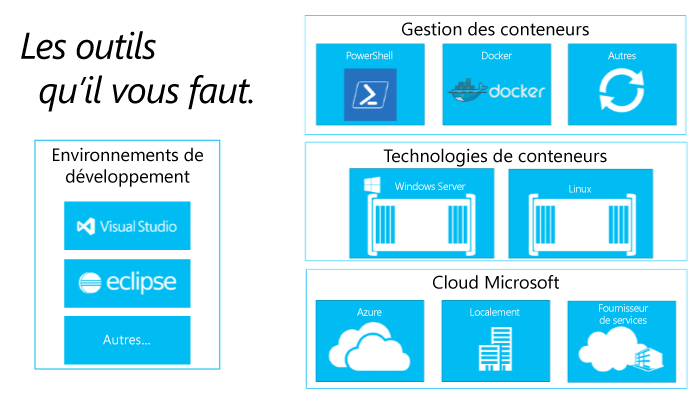

# À propos de la création d’écosystèmes de conteneurs

Pour comprendre pourquoi la création d’un écosystème de conteneurs est si importante, parlons d’abord de ses composants.

## Composants d’un écosystème de conteneurs

Les conteneurs Windows sont un composant clé d’un grand écosystème de conteneurs. Nous travaillons dans toute l’industrie pour offrir les choix des développeurs à chaque niveau de la pile de solution.

L’écosystème de conteneurs fournit des méthodes pour gérer, partager et développer des applications qui s’exécutent dans des conteneurs.

Microsoft souhaite encourager la productivité et les choix des développeurs à mesure qu’ils génèrent ces applications de nouvelle génération. Notre objectif est de dynamiser la productivité des développeurs, ce qui permet aux applications de cibler n’importe quel Cloud Microsoft sans avoir à modifier, réécrire ou reconfigurer du code.

Microsoft s’engage à être ouvert et compatible avec l’écosystème. Nous prenons activement en charge la combinaison de plusieurs écosystèmes de développement intéressants, comme Windows et Linux, pour favoriser l’innovation.

Au fil des prochains mois, nous vous fournirons des informations supplémentaires sur les partenaires supplémentaires dans cet écosystème de développement.